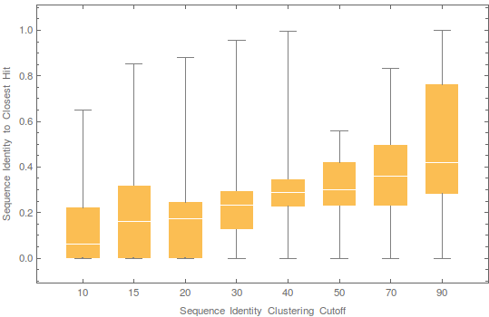
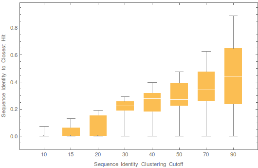

# Splitting Methodology
### ML Background
One of the routine but critical tasks in machine learning experiments is the splitting of data sets into three disjoint subsets, a training set to fit model parameters, a validation set to fit model hyperparamters (e.g. architectural choices), and a test set to assess model quality after all fitting is done and the model is ready for publication. One convenient way to think about the distinction between these subsets is the number of parameters being fitted and the number of times that the subset is evaluated. For training deep learning models, often millions of parameters (or more) are fit using the training set, through tens, hundreds, or even thousands of epochs of training. This means that the training set is evaluated thousands of times during the course of training. For fitting hyperparameters, typically a dozen to a hundred choices must be made, resulting in tens to hundreds of evaluations of the validation set. For the final model to be evaluated, there is nothing to be fit anymore, and the test is evaluated once. The number of evaluations made of a given subset is a heuristic of the degree of overfitting to each of these subsets. Having a robust division of data sets along these lines is thus critical for honest assessment of new methods and for the genuine advancement of machine learning methodology. Inadvertent "information leakage" from the validation set into the training set can lead to a false sense of progress, as the validation set ceases to be an accurate proxy of the distributional shifts that may be encountered in the test set. Worse, information leakage from the test set into the validation or (most egregiously) the training set can lead to overfitting on the test set itself, leading to an inaccurate and misleading assessment of model quality.

### Biology Background
In most ML domains, the splitting of data sets into training / validation / test sets is relatively straightforward, and is often done completely at random as the data is assumed to be sampled I.I.D. For protein sequences this assumption is not valid, in fact it's grossly invalid, as proteins share an evolutionary relationship that virtually guarantees that every protein is related to some other protein. Worse yet, unlike for example images in which two pictures of the same cat can be entirely distinct at the pixel level, protein sequences are sequences of categorical variables, and thus two identical proteins are literally identical from the perspective of machine representation. Even two related proteins can be 99%+ identical when represented as one-hot vectors. This necessitates that great care is taken when splitting data sets to insure that the validation and test sets are meaningfully distinct from the training set. This is doubly important in the field of protein structure prediction, which historically has a bad track record of overzealous claims of "solutions to the protein folding problem", when these so-called solutions turned out be nothing more than exercises in overfitting. In fact, the blind CASP assessments arose in part in response to this problem, to insure that computational methodology could be assessed in a fair and transparent manner that does not allow for inadvertent or intentional misrepresentation.

### Splitting by Clustering
One approach to splitting biological sequence data is to cluster the sequences using some metric, for example sequence identity, and then use a subset of the clusters for training and the rest for validation and testing. This is the approach we take, with some important specifics.

First, while we use sequence identity as the metric for defining the size of clusters, naive use of sequence identity to find related proteins is generally problematic, as evolutionarily-related proteins cease to exhibit a detectable and robust signal in the so-called twilight zone, typically below 30% sequence identity. The problem is two-fold: evolutionarily-unrelated proteins may register as having a sequence identity of e.g. 10%, when in reality the relationship is spurious. More problematically, two evolutionarily-related proteins may not be detectable as such, even though their actual sequence identity is 10%. These problems arise most frequently when the comparison is made based on the protein sequences alone, as is done for example in BLASTClust, which is the method used by the PDB in their standard clusterings. For sequence identity >30%, which is the minimum the PDB provides, this is not a problem. But for ML purposes, 30% seq. id. is too high, particularly for problems like structure prediction in which two proteins can share very similar structures even when their sequences vary by ~70%. In our modeling applications, we have found that to provide validation sets that correspond to new protein topologies, similar to the CASP FM category of proteins, sequence identity must drop below 20% or even 10%.

A solution to this problem is found through using profile-profile alignments to detect deep sequence homology, which is (unofficially) supported by the [MMseqs2 software package](https://github.com/soedinglab/MMseqs2). Sequence profiles are built of multiple sequence alignments of protein families and effectively summarize the evolutionary neighborhood around a point in protein sequence space. Profile-profile-based clustering compares sequences using their profiles and establishes sequence identity through much more sensitive alignments than would be possible using sequence-sequence or sequence-profile comparisons. Through the generous help and support of the MMseqs2 team, we believe we have robustly clustered protein sequences down to below 10% sequence identity.

Second, the way the clustering is done can result in information leakage. For starters, consider a clustering approach in which clusters are formed out of all sequences that lie within a sequence identity distance D from the cluster center. If two such clusters are adjacent, in the sense that their outermost members are less than D apart (this does not violate the construction), then including all members of one cluster in the training set and all members of the other cluster in the validation set would violate the stipulation that all training and validation entries are at least D distance apart. To prevent this problem, we only include the cluster centers as entries in the validation set. Hence each validation entry actually corresponds to an entire cluster! As a result, our validation sets are somewhat small (228 entries, divided into 7 groups of 32 members each, with each group corresponding to a different sequence identity threshold), because a single entry can correspond to hundreds of protein structures. If we were to use a very large validation set, a substantial fraction of the data would be excluded from the training set. Because each validation entry is highly distinct from all other entries however, we found that the validation sets are highly informative of test accuracy.

A related issue is the fact that proteins can be made up of partially overlapping domains, e.g. one protein contains domains AB, and another contains BC. If the distance metric is defined on the full length protein, then even though a partial region may be identical between the two proteins, the overall sequence distance may be quite high. To address this, we take a maximally conservative approach, defining distance in terms of the overlapping region between two proteins, and ignoring the non-overlapping regions. This can occasionally result in proteins being unnecessarily included in the same cluster, but we found it to prevent any form of information leakage. Furthermore, as this is only relevant for the validation set, the impact on the amount of usable data is kept fairly minimal. Below is a figure that demonstrates the difference between a conventional clustering pipeline that defines distance in terms of the entire protein (left), and the approach we take (right). The x-axis corresponds to the target sequence identity threshold we set, while the y-axis corresponds to the observed sequence distance between entries in the validation and training sets, with the distribution over entries in the validation set shown as box-and-whisker charts. As is evidently clear, the left version suffers from information leakage, with validation entries far closer than desired getting included. The right version on the other hand never includes a validation entry that is closer to the training set than is desired.

&nbsp;&nbsp;&nbsp;&nbsp;&nbsp;&nbsp;&nbsp;&nbsp;

Using this approach we cluster the data into groups of increasing sequence identity, starting with 10% and ending with 90%. After each clustering, we extract a number of clusters to use for validation, and repeating the clustering with a higher threshold. Once all validation subsets are extract the training set remains. We subsequently cluster the training data at different thresholds as well to provide different sampling densities for training. This process does not impact the validation or quality assessment aspects of the splits. It's merely there as a convenience to control the size of the training set and the granularity of structural variation present.
